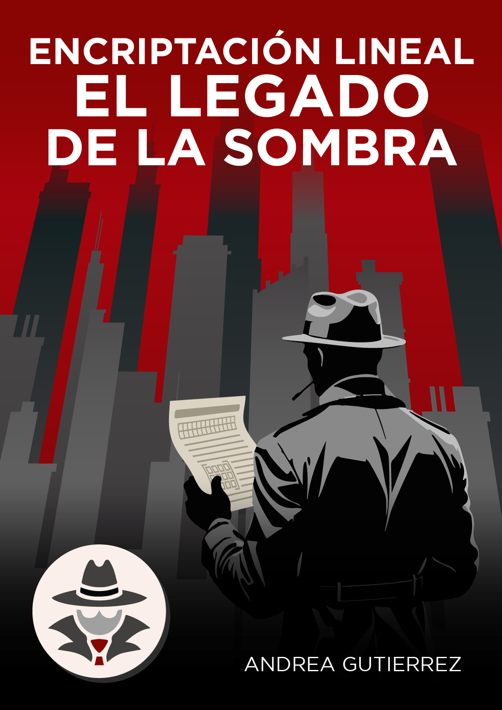
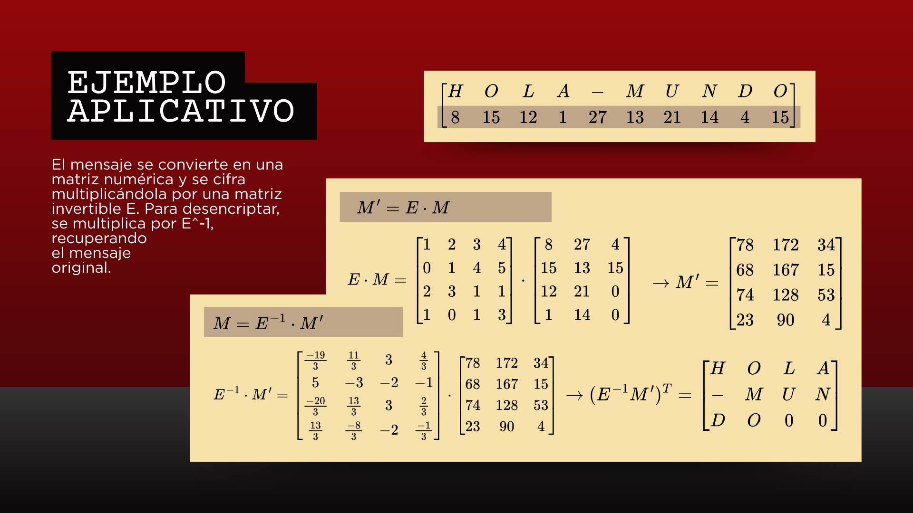
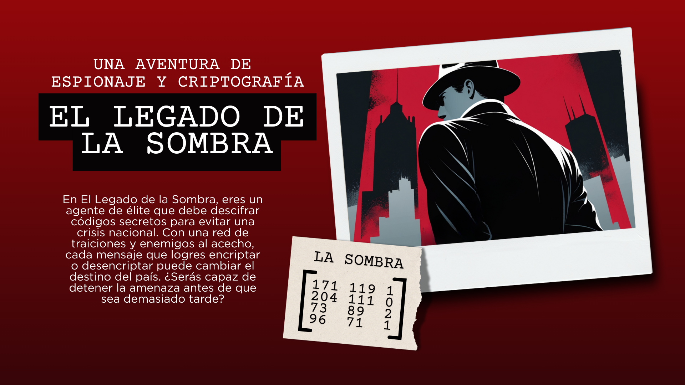
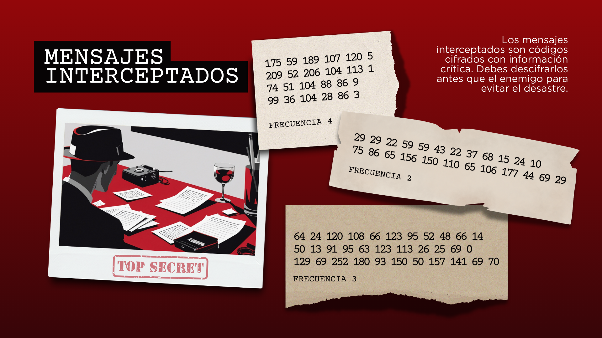
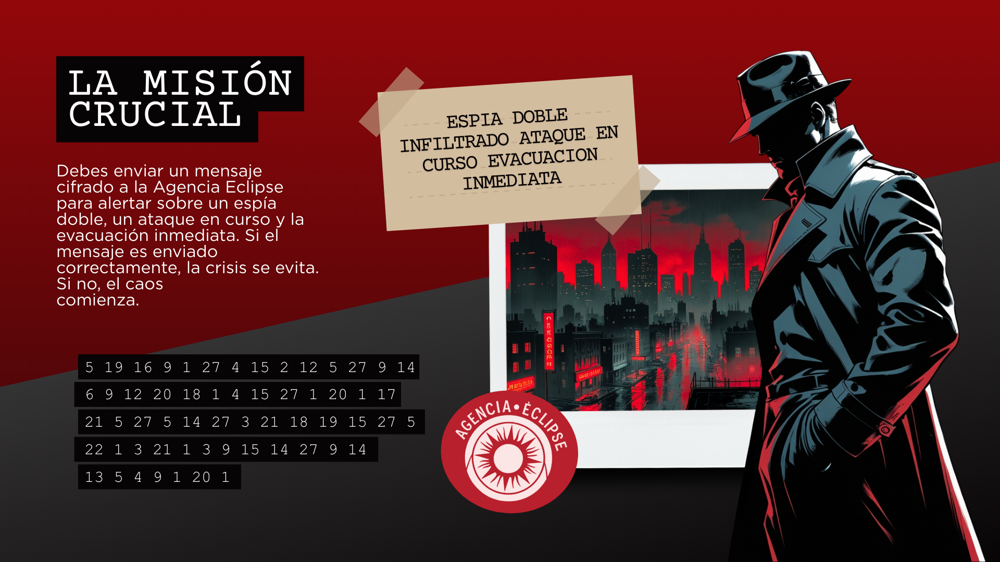
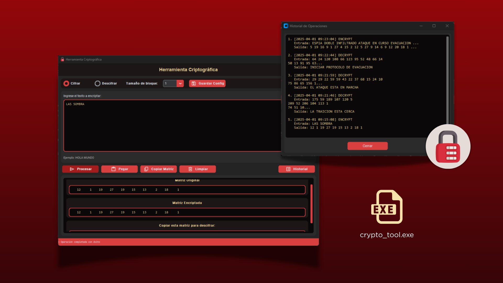

# Encriptación Lineal: El Legado de la Sombra 🕵️

[](#)
[](#)
[](#)
[](#)
[](#)



[](#)

## Descripción del proyecto

Este proyecto interactivo combina dos componentes complementarios:

1. **Herramienta de Criptografía Matricial (Python):**
    
    Una aplicación gráfica que implementa un sistema de cifrado/descifrado basado en álgebra lineal. Convierte mensajes de texto en matrices numéricas, aplica una transformación lineal mediante una matriz de encriptación invertible y permite recuperar el mensaje original. Está diseñada tanto para fines educativos como para facilitar la comprensión práctica de conceptos matemáticos y de criptografía.
    
2. **El Legado de la Sombra (Web):**
    
    Un videojuego narrativo de espionaje y criptografía. A través de distintos capítulos interactivos y decisiones en la historia, el jugador se sumerge en una aventura en la que deberá descifrar mensajes críticos utilizando el mismo método de encriptación. La narrativa se complementa con imágenes, diálogos y efectos visuales que enriquecen la experiencia.
    

Ambas partes están integradas para ofrecer una experiencia completa donde la teoría y la práctica de la criptografía por aplicación lineal se unen en un entorno didáctico y entretenido.

## Características

- **Herramienta de Criptografía Matricial (Python):**
    - Conversión de texto a matriz numérica y viceversa.
    - Cifrado mediante multiplicación matricial con soporte para bloques de tamaños variables (de 1×1 a 4×4).
    - Interfaz gráfica intuitiva utilizando CustomTkinter y Tkinter.
    - Historial de operaciones y guardado automático de configuraciones.
    - Uso de librerías como NumPy, Pillow y módulos estándar (json, datetime, os, platform).
- **El Legado de la Sombra (Web):**
    - Videojuego narrativo interactivo con una historia de espionaje y misterio.
    - Capítulos divididos en secciones con diálogos, imágenes y decisiones clave que afectan el desarrollo de la trama.
    - Integración de un encriptador/descencriptador basado en el método de aplicación lineal, permitiendo al usuario descifrar mensajes interceptados en la narrativa.
    - Diseño moderno con estilos personalizados (CSS) y una interfaz optimizada para la experiencia del usuario.

## Requisitos Previos

Para la herramienta de Python:

- Python 3.6 o superior.
- Dependencias:
    - NumPy
    - CustomTkinter
    - Pillow

Para el juego web:

- Navegador moderno compatible con HTML5, CSS3 y JavaScript.

## Instalación

1. **Clona el repositorio:**
    
    ```bash
    git clone https://github.com/GutBla/PROJECT_Encriptacion_Lineal_El_Legado_de_la_Sombra.git
    ```
    
2. **Accede al directorio del proyecto:**
    
    ```bash
    cd PROJECT_Encriptacion_Lineal_El_Legado_de_la_Sombra
    ```
    
3. **Instala las dependencias para la herramienta de Python:**
    
    ```bash
    pip install numpy customtkinter pillow
    ```
    

## Uso

### Herramienta de Criptografía Matricial (Python)

Ejecuta la aplicación con:

```bash
python main.py
```

Se abrirá una interfaz gráfica en la que podrás:

- Seleccionar entre los modos de encriptación y desencriptación.
- Elegir el tamaño de bloque para el mensaje.
- Ingresar el texto o la matriz numérica.
- Visualizar el proceso y copiar o pegar resultados.

Además, puedes ejecutar directamente el ejecutable compilado:

1. Navega al directorio `output`:
    
    ```bash
    cd output
    ```
    
2. Ejecuta el archivo:
    
    ```bash
    Crypto_tool.exe
    ```
    

### El Legado de la Sombra (Web)

Para jugar al videojuego:

1. Abre el archivo `index.html` en tu navegador.
2. Navega a través de la narrativa interactiva que incluye capítulos, diálogos y decisiones.
3. Utiliza el encriptador/descencriptador integrado para resolver los mensajes cifrados y avanzar en la historia.

## Metodología de Encriptación de mensajes por aplicación lineal



Podemos codificar un mensaje realizando una pequeña biyección con las letras del alfabeto con los números naturales, donde el cero no tendrá asignado ningún carácter:

| A | B | C | D | E | F | G | H | I | J | K | L | M | N | O | P | Q | R | S | T | U | V | W | X | Y | Z | - |
| --- | --- | --- | --- | --- | --- | --- | --- | --- | --- | --- | --- | --- | --- | --- | --- | --- | --- | --- | --- | --- | --- | --- | --- | --- | --- | --- |
| 1 | 2 | 3 | 4 | 5 | 6 | 7 | 8 | 9 | 10 | 11 | 12 | 13 | 14 | 15 | 16 | 17 | 18 | 19 | 20 | 21 | 22 | 23 | 24 | 25 | 26 | 27 |

Sea entonces un mensaje compuesto de $*m ∈ ℕ*$ caracteres, donde dado la tabla anterior podemos obtener un arreglo con los números que componen el mensaje. Teniendo entonces que los elementos en el arreglo, son los $*x_i ∈ [0, 27]*$ que representan los caracteres del mensaje. Donde el cero está reservado para espacios vacíos.

| $*x_1*$ | ⋯ | $*x_i*$ | ⋯ | $*x_m*$ |
| --- | --- | --- | --- | --- |

Esta sería una encriptación muy sencilla, pues podría descifrarse investigando qué letra le corresponde a cada número.

Ahora dividamos el arreglo en partes iguales, supongamos que dividimos en $*n≤m*$ partes iguales, con $*n∈ℕ*$, donde si el arreglo no puede ser divisible exactamente podemos aumentar el arreglo. Si $n \lceil\frac{m}{n}\rceil > m$ entonces el arreglo será de $m+ ( n \lceil\frac{m}{n}\rceil -m)$ entradas, donde estas últimas entradas añadidas a la cadena serían llenadas por el valor cero. Ahora nuestro arreglo sería de longitud $m_{1}=m+ ( n \lceil\frac{m}{n}\rceil -m)=n \lceil\frac{m}{n}\rceil$, donde la longitud de cada subarreglo será $\lceil\frac{m}{n}\rceil$.

| $*x_1*$ | ⋯ | $*x_i*$ | ⋯ | $*x_m*$ | $0_{m + 1}$ | ⋯ | $0_{n \lceil\frac{m}{n}\rceil=m_{1}}$ |
| --- | --- | --- | --- | --- | --- | --- | --- |

En todo caso, ahora el arreglo es divisible y por lo tanto podemos particionarlo de la siguiente manera.

| $(x_1$ | ⋯ | $x_{\frac{m_{1}}{n}})_1$ | $(x_{\frac{m_{1}}{n}+1}$ | ⋯ | $x_{\frac{2m_{1}}{n}})_2$ | ⋯ | $(x_{\frac{(n-1)m_{1}}{n}+1}$ | ⋯ | $x_{\frac{nm_{1}}{n}})_n$ |
| --- | --- | --- | --- | --- | --- | --- | --- | --- | --- |

Ahora podemos haber armado vectores en $\mathbb{R}^{\frac{m_{1}}{n}}$, con $n,\frac{m_{1}}{n} \in \mathbb{N}$. Notemos que podemos armar una matriz, tomando el elemento inicial de cada subarreglo hasta su último elemento y escribiéndolo de manera vertical.

$$
M_{\frac{m_{1}}{n} \times n} = \begin{bmatrix}
x_{1} & x_{\frac{m_{1}}{n}+1} & \cdots & x_{\frac{(n-1)m_{1}}{n}+1} \\
\vdots & \vdots & \ddots & \vdots \\
x_{\frac{m_{1}}{n}} & x_{\frac{2m_{1}}{n}} & \cdots & x_{\frac{nm_{1}}{n}}
\end{bmatrix}
$$

Obteniendo así una matriz de $\frac{m_{1}}{n} \times n$. Ahora podemos modificar la matriz para hacerla más difícil de descifrar. Esto mediante transformaciones lineales.

Sea

$$
\begin{aligned}
T &: \mathbb{R}^{\frac{m_{1}}{n} \times n} \to \mathbb{R}^{\frac{m_{1}}{n} \times n}, \\
M &\mapsto (E)M = M^{\prime}
\end{aligned}
$$

Donde $M \in \mathcal{M}_{\frac{m_{1}}{n} \times n}(\mathbb{K})$, es decir la matriz de caracteres y $E \in \mathcal{M}_{\frac{m_{1}}{n} \times \frac{m_{1}}{n}}(\mathbb{K})$, la matriz de encriptación y por lo tanto *M*′ la matriz encriptada, con lo cual transformamos la matriz original en una mucho más complicada de descifrar, aun así dado de que necesitaríamos desencriptar el mensaje, es necesario que *E* sea invertible, es decir $∃E^{−1}$ tal que $*EE^{−1} = I*$, con $E,I \in \mathcal{M}_{\frac{m_{1}}{n} \times \frac{m_{1}}{n}}(\mathbb{K})$.

Ahora bien, podemos partir de la matriz identidad para definir a *E* como el conjunto de operaciones elementales de matrices aplicadas a la matriz identidad $*E = (On(…(O1(I))))*$, para construir la matriz que nosotros deseemos mediante operaciones elementales. Donde en efecto $*E^{−1}= ( O_{1}^{-1}(…( O_{n}^{-1}(I))))*$, así el proceso de desencriptación vendría dado por:

$$
\begin{aligned}
T^{-1} &: \mathbb{R}^{\frac{m_{1}}{n} \times n} \to \mathbb{R}^{\frac{m_{1}}{n} \times n}, \\
M^{\prime} &\mapsto (E^{-1})M^{\prime} = M
\end{aligned}
$$

Recordando que luego las columnas hay que organizarlas como vectores horizontales consecutivos y traducir con la tabla inicial o tomar la traspuesta de la matriz de valores y traducir directamente los valores, así podremos leer el mensaje de izquierda a derecha y de arriba a abajo. Teniendo así que podemos tener cualquier matriz según lo deseemos para encriptar nuestros mensajes, siempre y cuando se use la inversa correspondiente.

### Ejemplo Aplicativos:

La cadena:

| H | O | L | A | - | M | U | N | D | O |
| --- | --- | --- | --- | --- | --- | --- | --- | --- | --- |

Tenemos $m = 10$, entonces tomemos $n = 3$, entonces $m_1 = 12$ y por lo tanto subarreglos de $\lceil\frac{m}{n}\rceil=4$, obteniendo así:

| 8 | 15 | 12 | 1 | 27 | 13 | 21 | 14 | 4 | 15 | 0 | 0 |
| --- | --- | --- | --- | --- | --- | --- | --- | --- | --- | --- | --- |

Por lo tanto el mensaje en una matriz cifrada sería:

$$
M = \begin{bmatrix}
8 & 27 & 4 \\
15 & 13 & 15 \\
12 & 21 & 0 \\
1 & 14 & 0
\end{bmatrix}
$$

Por lo tanto tomemos nuestra matriz 4×4 siguiente:

$$
E = \begin{bmatrix}
1 & 2 & 3 & 4 \\
0 & 1 & 4 & 5 \\
2 & 3 & 1 & 1 \\
1 & 0 & 1 & 3
\end{bmatrix}
$$

Y por lo tanto:

$$
E^{-1} = \begin{bmatrix}
\frac{-19}{3} & \frac{11}{3} & 3 & \frac{4}{3} \\
5 & -3 & -2 & -1 \\
\frac{-20}{3} & \frac{13}{3} & 3 & \frac{2}{3} \\
\frac{13}{3} & \frac{-8}{3} & -2 & \frac{-1}{3}
\end{bmatrix}
$$

Así que:

$$
M^{\prime} = \begin{bmatrix}
78 & 172 & 34 \\
68 & 167 & 15 \\
74 & 128 & 53 \\
23 & 90 & 4
\end{bmatrix}
$$

Teniendo por último que el mensaje al desencriptarlo, trasponiendo y traduciendo sería:

$$
(E^{-1}M^{\prime})^{\top} =
\begin{bmatrix}
H & O & L & A \\
X & M & U & N \\
D & O & 0 & 0
\end{bmatrix}
$$

---
## **Juego El Legado de la Sombra**

**Una aventura de espionaje y criptografía**


### Capítulo 1: La Ciudad en la Penumbra

En una época de crisis, la corrupción y la traición han tejido una red que amenaza con desestabilizar la nación. En este oscuro panorama, la Agencia Eclipse opera en las sombras, custodiando secretos vitales para la supervivencia del país.

Tú eres **La Sombra**, un agente de élite cuyo ingenio y rapidez han quedado grabados en la historia de la agencia. Tu reputación es legendaria, y ahora te enfrentas a una misión que pondrá a prueba cada una de tus habilidades.

---

### Capítulo 2: El Método de Encriptación Lineal


El Oráculo se dirige a ti con voz serena:

"Buenas noches, agente. Hemos detectado que varios de nuestros mensajes han sido interceptados y nuestras formas de comunicación se han vuelto vulnerables."

Ante la gravedad de la situación, explicas: "Eso nos deja en una situación crítica, ¿cómo lo piensan solucionar?"

El Oráculo continúa: "Los espías en las filas han desarrollado un nuevo método de encriptación basado en álgebra lineal. Ve con el Profesor, él te explicará el proceso en detalle."

El Profesor te saluda cordialmente:

"Un placer conocer al famoso agente 'La Sombra'. El Oráculo me ha informado que necesitas entender nuestro nuevo método de encriptación lineal, ¿no es así?"

Confirmas: "Sí, él me envió."

El Profesor prosigue con entusiasmo:

"Prepárate, porque voy a explicarte cómo encriptamos y desencriptamos mensajes. Es tan sencillo como comprender la matemática detrás de ello. Empecemos, ¿listo?"

Con atención, el Profesor explica:

"Primero, asignamos un número a cada letra del alfabeto. La correspondencia es la siguiente:

$$
A \to 1, \; B \to 2, \; \dots, \; Z \to 26, \; - \to 27
$$

Si encontramos un espacio, lo representamos con 0 o lo usamos como relleno."

Observas que el proceso parece algo simple.

El Profesor continúa:

"Exacto. Luego, convertimos el mensaje en una secuencia de números. Supongamos que tenemos **m** caracteres; organizamos estos números en una matriz dividiéndolos en **n** partes iguales. Para ajustar el tamaño, si es necesario, rellenamos con ceros. La longitud total del arreglo será:

$$
m_1 = n \lceil m / n \rceil
$$

Eso es ingenioso y práctico."

"Conociendo el tamaño, formamos la matriz de encriptación, agrupando los números de la siguiente manera:

$$
M_{m_1/n \times n} =
\begin{bmatrix}
x_1 & x_{\frac{m_1}{n}+1} & \cdots & x_{(n-1)\frac{m_1}{n}+1} \\
\vdots & \vdots & \ddots & \vdots \\
x_{\frac{m_1}{n}} & x_{2\frac{m_1}{n}} & \cdots & x_{n\frac{m_1}{n}}
\end{bmatrix}
$$

Lo voy entendiendo."

El Profesor prosigue con tono decisivo:

"¡Ya tenemos la matriz lista! Ahora, la parte crucial: aplicar una transformación lineal mediante una matriz de encriptación *E* que debe ser invertible. Multiplicamos nuestra matriz original *M* por *E* para obtener el mensaje encriptado *M′*:

$$
M' = E \cdot M
$$

De esta forma, si el enemigo intercepta el mensaje, no podrá leerlo sin conocer la matriz clave *E*."

Reflexionas: "Eso le agrega un nivel más de complejidad."

El Profesor concluye:

"Para desencriptar, usamos la matriz inversa *E⁻¹*, recuperando el mensaje original mediante:

$$
M = E^{-1} \cdot M'
$$

Luego, reordenamos el vector resultante y aplicamos el mapeo inverso para volver a obtener el texto legible."

Ante tu pregunta sobre si hay algún paso más, el Profesor responde:

"Eso es todo. Para confirmar que has comprendido el método, ingresa el alias asignado al espía ('La Sombra') en forma numérica."

Así se establece un desafío: demostrar que comprendes el proceso transformando "LA SOMBRA" en su equivalente numérico.

---

### Capítulo 3: Los Mensajes Interceptados



Tres mensajes han sido interceptados. Proceden de un agente de la agencia y su contenido es crítico: si los enemigos los descifran antes que tú, el plan se desmoronará. Tu misión es encontrar el verdadero significado de al menos dos de ellos para tener la oportunidad de completar la misión.

### Primer Mensaje: Frecuencia 4

Se presenta la siguiente matriz cifrada:

```
175 59 189 107 120 5
209 52 206 104 113 1
74 51 104 88 86 9
99 36 104 28 86 3
```

El mensaje podría significar: "La traición está cerca." Aunque se ofrecen otras interpretaciones como "El enemigo ya ha sido derrotado", "La calma ha regresado al frente" o "Se ha encontrado una solución diplomática", tu análisis indica:

"Un espía doble se ha infiltrado en la Agencia. Necesitamos actuar con precaución."

### Segundo Mensaje: Frecuencia 2

La matriz cifrada es la siguiente:

```
29 29 22 59 59 43 22 37 68 15 24 10
75 86 65 156 150 110 65 106 177 44 69 29
```

Entre las posibles interpretaciones, la opción correcta es: "El ataque está en marcha." Otras alternativas sugieren que "El ataque ha sido detenido con éxito", "El enemigo ha sido engañado y se retira" o que "Se ha firmado una tregua con el enemigo". Ante la situación, se piensa:

"El enemigo ha iniciado su ofensiva. Debemos tomar decisiones rápidas."

### Tercer Mensaje: Frecuencia 3

La siguiente matriz cifrada se presenta:

```
64 24 120 108 66 123 95 52 48 66 14
50 13 91 95 63 123 113 26 25 69 0
129 69 252 180 93 150 50 157 141 69 70

```

La lectura correcta es: "Iniciar protocolo de evacuación." Otras interpretaciones, como "Preparar defensa en las zonas rurales", "Enviar refuerzos a la línea de frente" o "Continuar con el avance hacia el objetivo principal", se descartan. En este punto, el pensamiento es claro:

"Deben evacuar las áreas críticas antes de que sea demasiado tarde."

---

### Capítulo 4: La Misión Crucial



La misión final recae sobre tus hombros. El destino de la nación pende de un hilo y solo tú puedes evitar que todo se derrumbe. Debes enviar un mensaje codificado a la Agencia Eclipse para prevenir una catástrofe.

El mensaje a transmitir es:
```
"ESPIA DOBLE INFILTRADO ATAQUE EN CURSO EVACUACION INMEDIATA"
```
Existen dos posibles desenlaces según la veracidad de la secuencia numérica enviada:

Si el mensaje es correctamente verificado, se confirma que "El mensaje ha sido enviado correctamente. La operación es un éxito. La Agencia Eclipse ha recibido la alerta a tiempo y el caos se ha evitado. La paz, aunque frágil, se mantiene... por ahora."

En cambio, si la verificación falla, se desencadena la crisis: "El código no fue verificado. La crisis se desata. El enemigo ha logrado penetrar nuestras defensas, y el ataque ha comenzado. La nación entra en un estado de emergencia."

---

### Epílogo


**Epílogo Final Bueno**:La misión fue un éxito. Lograste mantener la paz, aunque la calma es solo temporal y la amenaza se cierne constantemente en las sombras. La Agencia Eclipse continúa su labor secreta, consciente de que el enemigo nunca descansa.

**Epílogo Final Malo**:La misión falló. El ataque se ejecutó, la ciudad cayó en el caos y la Agencia Eclipse fue desmantelada. Los pocos sobrevivientes ahora viven en la clandestinidad, mientras la esperanza se desvanece en las sombras.

---

## Ejecución del Proyecto

A continuación, se presentan capturas y ejemplos de la ejecución del juego y sus herramientas de criptografía:

**Herramienta de Encriptación (crypto_tool.exe):** Permite cifrar y descifrar mensajes usando el método de encriptación lineal.



**Ejecución del Juego:** Muestra la interacción del jugador con los personajes y la resolución de los desafíos


**Secciones del Juego:** Vista general de los distintos escenarios, diálogos y mecánicas implementadas.


**Herramienta de Criptografía Integrada:** Demuestra la funcionalidad de encriptación dentro del juego, utilizada en misiones clave.


